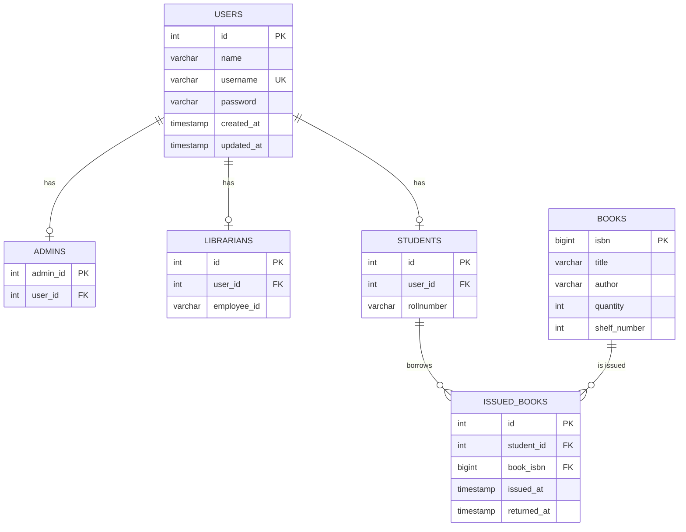

<div align="center">

# 📚 Library Management System

**A complete, production-ready library management solution built with Python & PostgreSQL**


---

*Manage books, users, and transactions through an intuitive command-line interface with role-based access control and secure authentication.*

</div>

<br/>

## 📋 Table of Contents

- [Overview](#-overview)
- [Tech Stack](#️-tech-stack)
- [Features](#-features)
- [Database Schema](#️-database-schema)
- [Project Structure](#-project-structure)
- [Getting Started](#-getting-started)
- [Usage Guide](#-usage-guide)
- [Default Credentials](#-default-credentials)

<br/>

## 🔍 Overview

This Library Management System is a **CLI-based application** that helps libraries manage their book inventory, user accounts, and book circulation — all backed by a PostgreSQL relational database.

The system supports **three user roles** — Admin, Librarian, and Student — each with tailored permissions and dashboards. Passwords are securely hashed using `bcrypt`, and all data is validated through `Pydantic` models before reaching the database.

### Why This Project?

| Problem | Solution |
|---|---|
| Manual book tracking is error-prone | Automated inventory with real-time quantity updates |
| No accountability for borrowed books | Full transaction history with timestamps |
| Shared credentials are insecure | Role-based access with hashed passwords |
| Difficult to search large catalogs | Search by title, author, or ISBN instantly |

<br/>

## 🛠️ Tech Stack

| Component | Technology | Purpose |
|---|---|---|
| **Language** | Python 3.14+ | Core application logic |
| **Database** | PostgreSQL | Persistent, relational data storage |
| **DB Adapter** | `psycopg` (v3) | Modern async-ready PostgreSQL driver |
| **Validation** | `pydantic` (v2) | Data models & input validation |
| **Security** | `bcrypt` | One-way password hashing |

<br/>

## ✨ Features

### 🔐 Authentication & Security

- **Secure Login** — Passwords are hashed with `bcrypt` before storage; plaintext passwords are never saved.
- **Role-Based Access** — Three distinct roles (Admin, Librarian, Student) with different permission levels.
- **Auto-Setup** — On first run with an empty database, a default Admin account is created automatically.

---

### 👑 Admin Panel

Admins have full control over the system:

| Action | Description |
|---|---|
| Add / Remove Books | Manage the entire library catalog |
| Add Students | Register new student accounts |
| Add Librarians | Register new librarian accounts |
| View All Users | See all admins, librarians, and students at a glance |
| Change Credentials | Update any user's username or password |

---

### 👨‍💼 Librarian Panel

Librarians handle day-to-day library operations:

| Action | Description |
|---|---|
| Add / Update / Remove Books | Full book catalog management |
| Issue Books | Check out books to registered students |
| Return Books | Process book returns with automatic timestamp |
| View Issue History | See all current and past transactions |
| Search by Roll Number | Find all books issued to a specific student |
| Search by Shelf | Locate books on a specific shelf |
| Add Students | Register new students on the spot |
| View All Students | List every registered student |
| Change Credentials | Update own username or password |

---

### 🎓 Student Panel

Students can browse, borrow, and manage their accounts:

| Action | Description |
|---|---|
| View Available Books | Browse the complete library catalog |
| Search Books | Find books by title, author, or ISBN |
| Borrow a Book | Self-service book checkout |
| Return a Book | Process a return from the student dashboard |
| View Borrowed Books | See currently borrowed and past reads |
| Change Credentials | Update own username or password |

---

### 📖 Book Circulation Logic

- **Issue** — Decrements book quantity in real-time when a book is checked out.
- **Return** — Increments quantity back and stamps the `returned_at` timestamp.
- **History** — Records are **never deleted**. Returned books keep a full audit trail for librarians.

<br/>

## 🗄️ Database Schema

The system uses a **normalized relational schema** with foreign key constraints:



> **Key Design Decisions:**
> - `users` is the **base table** — every person in the system has a row here.
> - Role-specific tables (`admins`, `librarians`, `students`) are linked via `user_id` foreign key.
> - `issued_books` acts as a **transaction ledger** — returning a book sets `returned_at` instead of deleting the row.

<br/>

## 📁 Project Structure

```
library-management-system/
│
├── main.py            → CLI entry point & menu routing
├── library.py         → Core business logic & SQL queries
├── models.py          → Pydantic data models & password utilities
├── database.py        → PostgreSQL connection configuration
│
├── pyproject.toml     → Project metadata & dependencies
├── uv.lock            → Dependency lock file
└── README.md          → You are here!
```

| File | Responsibility |
|---|---|
| `main.py` | Handles all user interaction — login flow, menu display, and input collection |
| `library.py` | Contains the `Library` class with all database operations (CRUD, search, issue/return) |
| `models.py` | Defines `User`, `Admin`, `Librarian`, `Student`, `Book`, and `IssuedBook` Pydantic models |
| `database.py` | Manages the PostgreSQL connection using `psycopg` with dictionary row factory |

<br/>

## 🚀 Getting Started

### Prerequisites

Before you begin, make sure you have:

- ✅ **Python 3.14** or higher installed
- ✅ **PostgreSQL** server running (locally or remotely)
- ✅ A database named `library_management_system` created in PostgreSQL

### Step 1 — Clone the Repository

```bash
git clone https://github.com/hassanwaheedali/project1.git
cd project1
```

### Step 2 — Install Dependencies

Using **pip**:

```bash
pip install psycopg[binary] bcrypt pydantic
```

Or using **uv** (recommended):

```bash
uv sync
```

### Step 3 — Configure the Database

Open `database.py` and update the connection settings to match your PostgreSQL setup:

```python
conn = psycopg.connect(
    host="127.0.0.1",           # Your database host
    dbname="library_management_system",  # Database name
    user="postgres",            # Your PostgreSQL username
    password="your_password",   # Your PostgreSQL password
    port=5432,                  # Your PostgreSQL port
)
```

### Step 4 — Set Up the Database Tables

Create the required tables in your `library_management_system` database:

```sql
-- Base users table
CREATE TABLE users (
    id       SERIAL PRIMARY KEY,
    name     VARCHAR(50)  NOT NULL,
    username VARCHAR(50)  NOT NULL UNIQUE,
    password VARCHAR(100) NOT NULL,
    created_at TIMESTAMP DEFAULT NOW(),
    updated_at TIMESTAMP DEFAULT NOW()
);

-- Role-specific tables
CREATE TABLE admins (
    admin_id SERIAL PRIMARY KEY,
    user_id  INT NOT NULL UNIQUE REFERENCES users(id)
);

CREATE TABLE librarians (
    id          SERIAL PRIMARY KEY,
    user_id     INT NOT NULL UNIQUE REFERENCES users(id),
    employee_id VARCHAR(50) NOT NULL
);

CREATE TABLE students (
    id         SERIAL PRIMARY KEY,
    user_id    INT NOT NULL UNIQUE REFERENCES users(id),
    rollnumber VARCHAR(50) NOT NULL
);

-- Book catalog
CREATE TABLE books (
    isbn         BIGINT PRIMARY KEY,
    title        VARCHAR(255) NOT NULL,
    author       VARCHAR(255) NOT NULL,
    quantity     INT NOT NULL CHECK (quantity >= 0),
    shelf_number INT NOT NULL CHECK (shelf_number >= 0)
);

-- Transaction ledger
CREATE TABLE issued_books (
    id         SERIAL PRIMARY KEY,
    student_id INT    NOT NULL REFERENCES users(id),
    book_isbn  BIGINT NOT NULL REFERENCES books(isbn),
    issued_at  TIMESTAMP DEFAULT NOW(),
    returned_at TIMESTAMP
);

-- View: User profiles with role info
CREATE VIEW vw_user_profiles AS
SELECT u.*, a.admin_id, l.employee_id, s.rollnumber
FROM users u
LEFT JOIN admins     a ON a.user_id = u.id
LEFT JOIN librarians l ON l.user_id = u.id
LEFT JOIN students   s ON s.user_id = u.id;

-- View: Issued books with details
CREATE VIEW vw_issued_books_details AS
SELECT
    i.id, i.book_isbn, i.issued_at, i.returned_at,
    b.title AS book_title, b.author AS book_author,
    u.name  AS student_name, s.rollnumber
FROM issued_books i
INNER JOIN students s ON i.student_id = s.user_id
INNER JOIN books    b ON i.book_isbn  = b.isbn
INNER JOIN users    u ON s.user_id    = u.id;
```

### Step 5 — Run the Application

```bash
python main.py
```

<br/>

## 📖 Usage Guide

### Login Flow

When the application starts, you'll be greeted with a login prompt:

```
==================================================
--- Welcome to the Library Management System! ---
==================================================

🔐 LOGIN
==================================================
Enter your username: admin
Enter your password: admin
✅ Login Successful! Welcome, Admin (Admin)
```

After login, the system automatically routes you to your role-specific panel (Admin, Librarian, or Student).

### Typical Workflows

**Adding a new student and issuing a book:**

1. Log in as **Admin** or **Librarian**
2. Select **"Add Student"** → Enter name, username, password, and roll number
3. Select **"Issue Book"** → Enter the student's roll number and the book's ISBN
4. The book quantity decreases by 1 automatically ✅

**Returning a book:**

1. Log in as **Librarian** or **Student**
2. Select **"Return Book"** → Enter the ISBN (and roll number if librarian)
3. The `returned_at` timestamp is recorded and quantity is restored ✅

<br/>

## 🔑 Default Credentials

On first run with an empty database, the system automatically creates a master admin:

| Field | Value |
|---|---|
| **Username** | `admin` |
| **Password** | `admin` |

> [!CAUTION]
> **Change the default password immediately after your first login!** Navigate to *Account Settings → Change Password* inside the Admin Panel.

<br/>

---

<div align="center">

**Built with ❤️ using Python & PostgreSQL**

</div>
